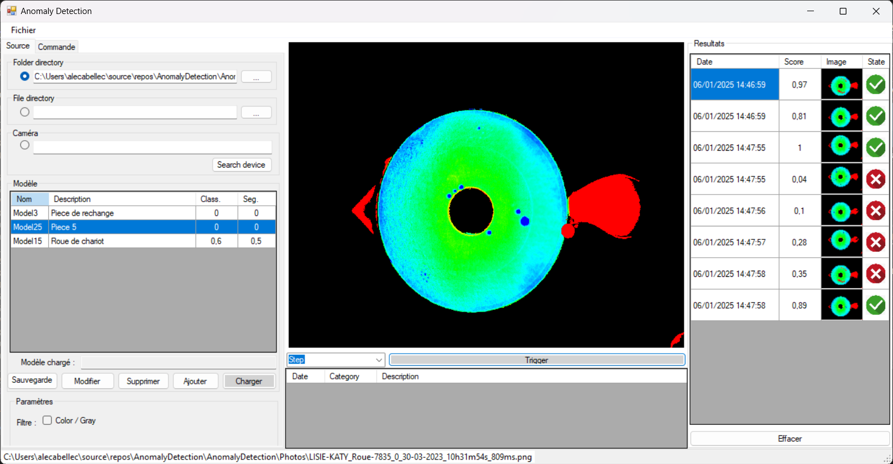

# AnomalyDetection

Prototype d'application de détection de défaut.

<!-- APP -->

    

> [!WARNING]
> Utilise la librairie HALCON MVTec 20.11, nécessite une licence

## 2 - AMELIORATION A FAIRE

## 3 - INFORMATION
> [!NOTE]
> L'application utilise HALCON MVTec 20.11.

(<a href="#readme-top">Back to top</a>)

